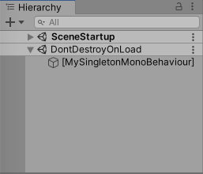
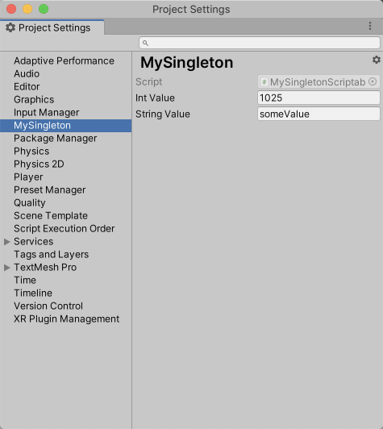

## UnitySingleton

UnitySingleton 提供了五种类型的单例的基类，在使用时根据需要创建对应的衍生类型即可。

### 简单单例

```c#
public class MySingleton : Singleton<MySingleton>
{
    public void MyMethod()
    {
    }
}
```

使用单例：

```c#
MySingleton.Instance.MyMethod();
```

### MonoBehaviour单例

```c#
public class MySingletonMonoBehaviour : SingletonMonoBehaviour<MySingletonMonoBehaviour>
{
    public void MyMethod()
    {
    }
}
```

使用单例：

```c#
MySingletonMonoBehaviour.Instance.MyMethod();
```

当单例被创建后，在Hierarchy中会显示：



### ScriptableObject单例

```c#
public class MySingletonScriptableObject : SingletonScriptableObject<MySingletonScriptableObject>
{
    public int intValue;
    public string stringValue;
}
```

使用单例：

```c#
UnityEngine.Debug.Log($"intValue is {MySingletonScriptableObject.Instance.intValue}");
```

当创建单例类之后，可以在Project Settings页面编辑。编辑页面的路径可通过添加`SettingsMenuPath`属性来指定。



是否在构建时包含ScriptableObject单例的实例（asset）以在运行时使用，可以通过覆写`ShouldIncludeInBuild`方法来定义，例如：

```c#
protected override bool ShouldIncludeInBuild()
{
    #if DEBUG && UNITY_ANDROID
        return true;
    #endif

    return false;
}
```

### 线程安全单例

```c#
public class MySingletonThreadSafe : SingletonThreadSafe<MySingletonThreadSafe>
{
    private int value;

    public int Increase()
    {
        return Interlocked.Increment(ref value);
    }
}
```

### 线程独有单例

```c#
public class MySingletonThreadLocal : SingletonThreadLocal<MySingletonThreadLocal>
{
    public void SomeMethod()
    {
        UnityEngine.Debug.Log(Thread.CurrentThread.ManagedThreadId);
    }
}
```

