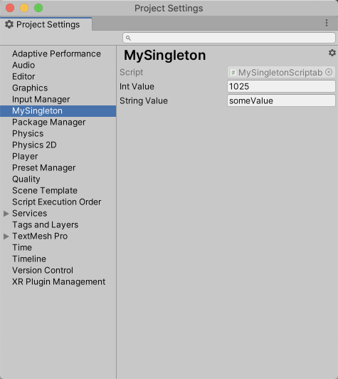

## UnitySingleton

[English version](README.md)

UnitySingleton 提供了六种类型的单例的基类，在使用时根据需要创建对应的衍生类型即可。

### 简单单例

最常用的单例，是单例模式最基本的实现。

定义单例：

```c#
public class MySingleton : Singleton<MySingleton>
{
    public void MyMethod()
    {
    }
}
```

使用单例：

```c#
MySingleton.Instance.MyMethod();
```

### MonoBehaviour单例

基于`MonoBehaviour`的单例。

定义单例：

```c#
public class MySingletonMonoBehaviour : SingletonMonoBehaviour<MySingletonMonoBehaviour>
{
    public void MyMethod()
    {
    }
}
```

使用单例：

```c#
MySingletonMonoBehaviour.Instance.MyMethod();
```

当单例被创建后，在Hierarchy中会显示：


### ScriptableObject单例

基于`ScriptableObject`的单例。

定义单例：

```c#
public class MySingletonScriptableObject : SingletonScriptableObject<MySingletonScriptableObject>
{
    public int intValue;
    public string stringValue;
}
```

使用单例：

```c#
UnityEngine.Debug.Log($"intValue is {MySingletonScriptableObject.Instance.intValue}");
```

当创建单例类之后，可以在Project Settings页面编辑。编辑页面的路径可通过添加`SettingsMenuPath`属性来指定。



是否在构建时包含ScriptableObject单例的实例（asset）以在运行时使用，可以通过覆写`ShouldIncludeInBuild`方法来定义，例如：

```c#
protected override bool ShouldIncludeInBuild(BuildReport report)
{
    bool devBuild = (report.summary.options & UnityEditor.BuildOptions.Development) == 0;
    bool android = report.summary.platformGroup == UnityEditor.BuildTargetGroup.Android;
    return android && devBuild;
}
```

### 持久化单例

定义单例：

```c#
public class MySingletonPersistent : SingletonPersistent<MySingletonPersistent>
{
    public bool enableSound;
    public bool enableMusic;
    public int volume;
}
```

单例支持运行时持久化存储，默认使用json格式存储，覆写'OnSave'和'OnLoad'以定制化存储和加载逻辑。

### 线程安全单例

定义单例：

```c#
public class MySingletonThreadSafe : SingletonThreadSafe<MySingletonThreadSafe>
{
    private int value;

    public int Increase()
    {
        return Interlocked.Increment(ref value);
    }
}
```

### 线程独有单例

定义单例：

```c#
public class MySingletonThreadLocal : SingletonThreadLocal<MySingletonThreadLocal>
{
    public void SomeMethod()
    {
        UnityEngine.Debug.Log(Thread.CurrentThread.ManagedThreadId);
    }
}
```

## 安装

克隆此仓库并放入工程目录中即可，或者在Package Manager窗口中将`https://github.com/aillieo/UnitySingleton.git#upm`添加为依赖项。
